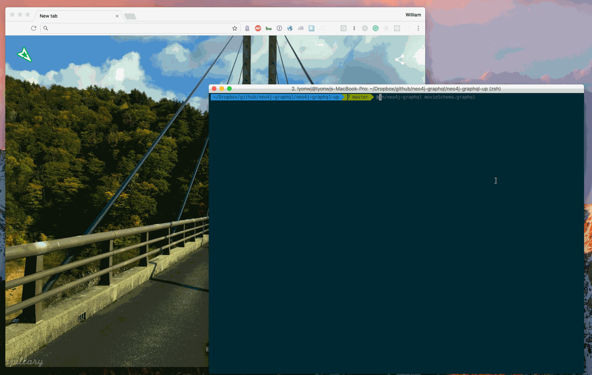

# Neo4j GraphQL CLI

## NOTE: This project is deprecated in favor of [the official Neo4j GraphQL Library](https://neo4j.com/product/graphql-library/)

Deploy Neo4j backed GraphQL APIs based on your custom GraphQL schema.

**This is a very early project, under active development. Use for prototyping and demo projects only**



**What does it do?**

*`neo4j-graphql-cli` allows you to deploy a Neo4j GraphQL instance on Neo4j Sandbox. This Neo4j GraphQL instance will serve a GraphQL endpoint based on a user-defined GraphQL schema.*

## Steps

1. `npm install -g neo4j-graphql-cli`
1. Define your GraphQL schema using GraphQL schema syntax, *myschema.graphql*
1. `neo4j-graphql myschema.graphql` - if you do not specify a schema a [default movies schema]() will be used.
1. When prompted sign into Neo4j Sandbox using the URL provided. This URL will include a token to associate your `neo4j-graphql-cli` session with your sandbox instance.
1. Once your Neo4j GraphQL instance is deployed, you'll be presented with the credentials for your GraphQL instance, including a Graphiql URL.

## Schema First Development

### IDL / Schema Syntax

### Neo4j GraphQL Schema

Neo4j GraphQL supports the basic schema syntax, with the addition of directives that expose the power of a graph database when combined with GraphQL:

* `@cypher`

**@cypher directive**

The `@cypher` directive exposes the power of a full graph query language, Cypher, through GraphQL. 

### Example movies schema

~~~graphql
type User {
  id: Int
  name: String!
  movies: [Movie] @relation(name: "RATED", direction: "out")
}

type Movie {
  id: Int
  title: String!
  year: Int
  plot: String
  poster: String
  imdbRating: Float
  genres: [Genre] @relation(name: "IN_GENRE", direction: "out")
  actors: [Actor] @relation(name: "ACTED_IN", direction: "in")
  directors: [Director] @relation(name: "DIRECTED", direction: "in")
  similar: [Movie] @cypher(statement: "WITH {this} AS this MATCH (this)-[:IN_GENRE]->(:Genre)<-[:IN_GENRE]-(rec:Movie) WITH rec, COUNT(*) AS num ORDER BY num DESC RETURN rec LIMIT 10")
}

type Genre {
  id: Int
  name: String!
  movies: [Movie] @relation(name: "IN_GENRE", direction: "in")
}

type Director {
  id: Int
  name: String!
  movies: [Movie] @relation(name: "DIRECTED", direction: "out")
}

type Actor {
  id: Int
  name: String!
  movies: [Movie] @relation(name: "ACTED_IN", direction: "out")
}
~~~


## .graphqlconfig

`neo4j-graphql-cli` supports [.graphqlconfig](https://github.com/graphcool/graphql-config) and will create a .graphqlconfig file that contains the path to the schema file, endpoints and authorization header. For example:

```
{
  "schemaPath":"personSchema.graphql",
  "extensions":
    {
      "endpoints":
      {
        "dev":
          {
            "url": "10-0-1-70-34285.neo4jsandbox.com/graphql/",
            "headers":
            {
              "Authorization":"Basic ${env:NEO4J_GRAPHQL_TOKEN}"
            }
          }
      }
    }
}
```

# Features

- [x] deploy Neo4j GraphQL Sandbox instance
- [x] support user defined GraphQL schema
- [x] support @cypher GraphQL schema directives
- [x] .graphqlconfig support
- [ ] support self-hosted Neo4j instances. NOTE: see 
- [ ] Docker support
- [ ] support schema updates
- [ ] client app scaffolding


# Feedback

This project is in active development and user validation. Have a use case you'd like to see supported? We'd love to hear your feedback, please email devrel@neo4j.com
